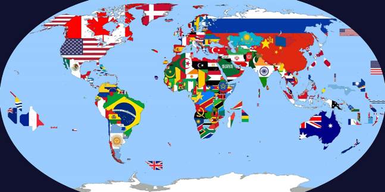

## Flagmania

**Flagmania** will help you understand if you know the flags of different parts of the world.  
The countries are so different - cold and hot, ancient and very young, located in Europe, Asia, Africa, the American continent...
But they have something in common: they all have their own flags.
**Flagmania** offers to guess which flag belongs to which country.
Note that this game is very fun to play together with friends and arrange competitions!
It will be interesting! Try it! 

## Running Locally 
Three, two, one... Let's start!

1. [Clone](git@github.com:mtv1301/Flagmania.git) the project
2. 